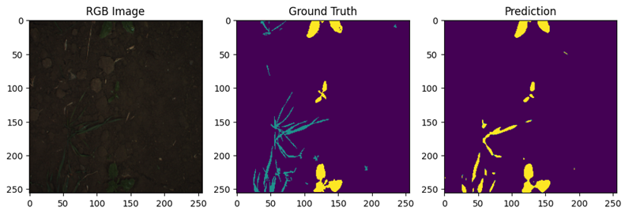

# Crop-Weed Segmentation Using RGB-NIR Images with U-Net

This repository contains a deep learning pipeline developed to perform pixel-level semantic segmentation for agricultural scene understanding, specifically distinguishing between **soil, crops, and weeds**. The project leverages both structural and spectral information by utilizing **4-channel (RGB-NIR) imagery** from the Sugar Beets 2016 dataset.

---

## 🌟 Key Features

* **4-Channel Input Pipeline:** Combines standard RGB channels with Near-Infrared (NIR) data (`[R, G, B, NIR]`) to significantly leverage spectral information for robust vegetation and soil separation.
* **U-Net Architecture:** Fully convolutional neural network tailored for high-precision semantic segmentation tasks.
* **Rigorous Hyperparameter Tuning:** Comparative benchmarks between Adam and SGD optimizers, varying learning rates, and batch sizes.
* **Reproducibility & Stability Analysis:** Verified training consistency across multiple random seeds to ensure reliable framework performance.
* **Cloud & Local Integration:** Transitioned local pipeline execution (RTX 3060) to cloud infrastructure (Google Colab T4 GPU) to maximize training throughput.

---

## 📊 Performance & Results

The optimal configuration achieved highly robust segmentation metrics on the test set:
* **Pixel Accuracy:** ~97%
* **Mean Intersection over Union (mIoU):** ~0.58 - 0.60

### Quantitative Evaluation Summary
* **Spectral Impact:** Incorporating the Near-Infrared (NIR) channel yields a notable performance increase in isolating vegetation from complex soil backgrounds.
* **Optimization:** The model achieved peak efficiency using the **Adam Optimizer** with a learning rate of $5 \times 10^{-4}$ and a batch size of 8 under Cross-Entropy loss.

### Visual Architecture & Results
Below is an example of the segmentation pipeline's performance, mapping raw inputs to pixel-accurate classification outputs:



---

## 📁 Repository Structure

```text
├── crop_weed_segmentation.ipynb  # Core training, data augmentation & evaluation notebook
├── baseline_model.pth                       # Trained U-Net model weights (PyTorch state_dict)
├── Technical_Project_Report.pdf    # Comprehensive scientific and technical project report
└── segmentation_results.png                        # Visual preview of inference results
```
---

## 🚀 Technical Stack & Keywords

* **Core Frameworks:** PyTorch, NumPy, OpenCV, Matplotlib
* **Domain:** Deep Learning, Computer Vision, Semantic Segmentation, Precision Agriculture, Multispectral Image Processing
* **Methodologies:** Data Augmentation, Hyperparameter Optimization, Feature Engineering (RGB-NIR fusion)
